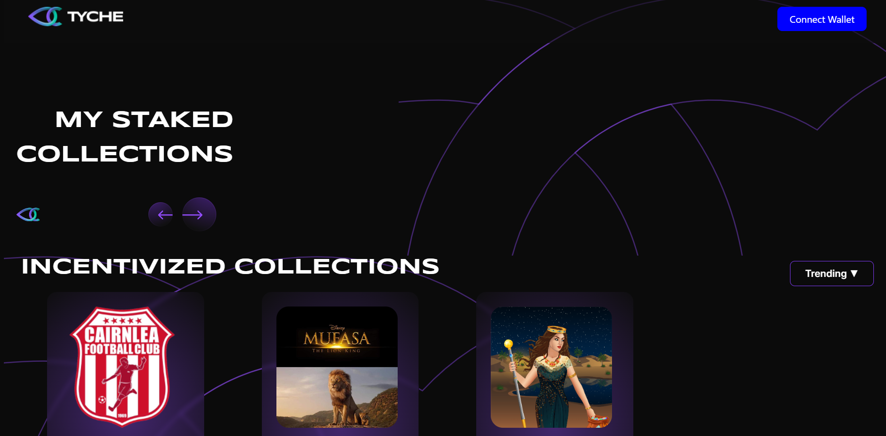

# How it works

The primary objective of this NFT platform is to enable TYCHE NFT holders to stake their NFTs in exchange for an APR in $TYCHE tokens, but it is not limited to only this use. We have designed this platform so that **every project on Zksync can utilize it and provide staking rewards to their users** using their own tokens or even ETH/USDC/USDT — whatever suits them best. \
\
[Stake on Base L2](https://base.weave.tyche.zone/)

[Stake on zkSync L2](https://mainnet.weave.tyche.zone/)

<figure><figcaption></figcaption></figure>
